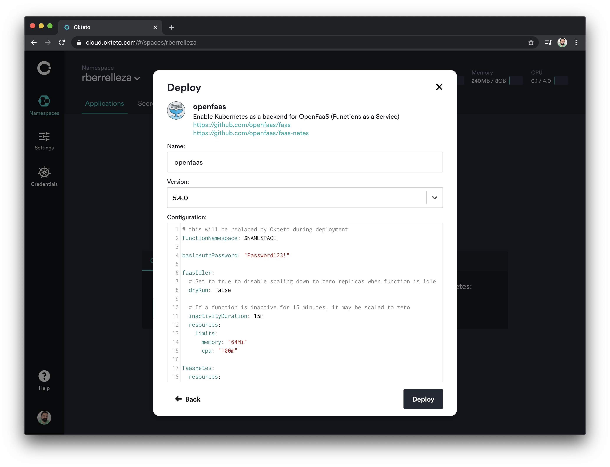
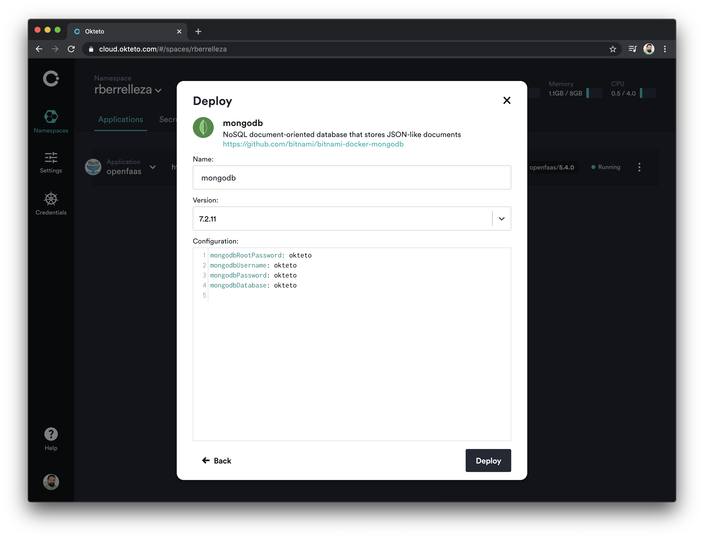

# Develop you Python functions with OpenFaaS and Okteto

## Prerequisites

1. Create a free account on Okteto Cloud
1. Install the [OpenFaaS cli](https://docs.openfaas.com/cli/install/)
1. Docker running on your local machine
1. Download and set your kubernetes credentials locally

## Steps

### Deploy your Initial Function

Login to Okteto Cloud and deploy your own instance of OpenFaaS. Don't forget to update the password!



Open a terminal, and export your github ID (e.g. rberrelleza)

```console
export GITHUBID=rberrelleza
```

Login to the Okteto Container Registry with `docker`. [Use your Okteto API token ](https://cloud.okteto.com/#/settings/setup) as the password.

```console
docker login registry.cloud.okteto.net -u $GITHUBID
```

```console
Password:
Login Succeeded
```

Once OpenFaaS is up and running, login to the gateway from your local computer.

```console
faas-cli login --gateway https://openfaas-ingress-$GITHUBID.cloud.okteto.net --password 'Password123!'
```

```console
Calling the OpenFaaS server to validate the credentials...
credentials saved for admin https://openfaas-ingress-rberrelleza.cloud.okteto.net
```

For this post, we are going to create a python function. We'll use `faas-cli` to create the basic skeleton, using the python3-debian template. This command will create a file called `hello-python3.yml` with all the details of your function.

```console
faas-cli new --lang python3-debian --prefix registry.cloud.okteto.net/$GITHUBID --gateway https://openfaas-ingress-$GITHUBID.cloud.okteto.net hello-python3
```

```console
...
...
Function created in folder: hello-python3
Stack file written: hello-python3.yml
```

Build and Deploy the first version of your function

```console
faas-cli up -f hello-python3.yml
```

```console
...
...
Deployed. 202 Accepted.
URL: https://openfaas-ingress-rberrelleza.cloud.okteto.net/function/hello-python3
```


The function is an `echo` function. You can try it out from the command line:

```console
https://openfaas-ingress-$GITHUBID.cloud.okteto.net/function/hello-python3 -d "hello"
```

```
hello
```


## Launch MongoDB

For the purpose of this demo, we are going to update our function to keep track of who attended our event. It needs to do the following:
- Access MongoDB
- On POST, take the body of the request and save in on mongodb
- On GET, return the list of attendees. 

You can deploy MongoDB with one click in Okteto Cloud, so we'll go with tat. Browse back to Okteto Cloud and deploy your MongoDB instance. 



The MongoDB instance deployed by Okteto creates a kubernetes secret with the password. We are going to use it directly in our function so we don't have to hard code any passwords, by using OpenFaaS' secrets. Update `hello-python3.yml` so it looks like this.

```yaml
version: 1.0
provider:
  name: openfaas
  gateway: https://openfaas-ingress-rberrelleza.cloud.okteto.net
functions:
  hello-python3:
    lang: python3-debian
    handler: ./hello-python3
    image: registry.cloud.okteto.net/rberrelleza/hello-python3:latest
    secrets:
      - mongodb
```

Launch your function again so it picks up this new configuration.

```console
faas-cli up -f hello-python3.yml
```


## Develop your function

Now is time to add our new code. Normally, you would write the code locally, repackage your function, push the container, wait for the update... Instead, we are going to do it the Okteto style, directly in the cluster. First, create `hello-python3/okteto.yml` and paste the content below. 

```yaml
name: hello-python3
workdir: /home/app
command: ["bash"]
mountPath: /home/app/function
```

This file will tell `okteto` to convert your `hello-python3` function into a development environment. It will keep the same configuration, permissions, volumes, etc... but `okteto` will automatically synchronize your code automatically into `/home/app/function`. 

Start your development environment by running `okteto up` in the `hello-python3` folder:

```console
cd hello-python3
okteto up
```

```console
 ✓  Development environment activated
 ✓  Files synchronized
    Namespace: rberrelleza
    Name:      hello-python3
```

And start the function execution by running `fwatchdog` in your remote development environment:

```console
app@hello-python3-846f46875f-h99tn:~$ fwatchdog
```

```console
2020/04/25 07:14:33 Version: 0.18.1	SHA: b46be5a4d9d9d55da9c4b1e50d86346e0afccf2d
2020/04/25 07:14:33 Timeouts: read: 5s, write: 5s hard: 0s.
2020/04/25 07:14:33 Listening on port: 8080
2020/04/25 07:14:33 Writing lock-file to: /tmp/.lock
2020/04/25 07:14:33 Metrics listening on port: 8081
```

At this point, we have the same function we had before, but in a live development environment. Validate that everything works by calling the function again from your local terminal:

```console
$ curl https://openfaas-ingress-$GITHUBID.cloud.okteto.net/function/hello-python3 -d "hello"
```

```
hello
```

Let's implement the first part of our new function. We'll change it so it returns and updates our list of attendees. Open `handler.py` in your local IDE, and update it  to look like this:

```python
import os, json

def handle(req):
    """handle a request to the function
    Args:
        req (str): request body
    """

    method = os.getenv("Http_Method")
    
    if method == "POST":
        return "ok"

    elif method == "GET":
        result = []
        return json.dumps(result)

    return "method not supported"
```

Save the file, go back to your local terminal, and call the function again:

```console
$ curl https://openfaas-ingress-$GITHUBID.cloud.okteto.net/function/hello-python3
```

```console
[]
```

As soon as you change the code  `okteto` synchronizes it to your remote development environment. And as soon as it's updated there, OpenFaaS hot reloads your code, giving you instant feedback on your code changes. So fast.

One of my favorite things about building applications with Okteto is the fact that my remote development environment looks just like production. This means that I have access to the same features, APIs and access patterns that my app is going to use in production. In this case, we can to take advantage of Kubernetes and OpenFaaS' secrets from the very beginning. 

When you add a secret in OpenFaaS, it will be mounted inside the `/var/secrets/openfaas` folder in your function. Our development environment inherits all the configuration, so we can use the same mechanism to get the password. Let's update the code to get the password from that directory and create the mongoDB URI.

```python
import os, json

def get_uri():
    with open('/var/openfaas/secrets/mongodb-password', 'r') as file:
        password = file.read().replace('\n', '')
    return "mongodb://root:{password:s}@mongodb".format(password=password)


def handle(req):
    """handle a request to the function
    Args:
        req (str): request body
    """

    uri = get_uri()
    method = os.getenv("Http_Method")
    if method == "POST":
        return "ok"

    elif method == "GET":
        result = []
        return json.dumps(result)

    return "method not supported"
```

Finally, let's implement our read / write logic. To keep things simple, we'll assume that the body of the request contains the github ID of the attendee:

```python
import os, json
from pymongo import MongoClient

def get_uri():
    with open('/var/openfaas/secrets/mongodb-password', 'r') as file:
        password = file.read().replace('\n', '')
    return "mongodb://root:{password:s}@mongodb".format(password=password)


def handle(req):
    """handle a request to the function
    Args:
        req (str): request body
    """

    uri = get_uri()
    client = MongoClient(uri)
    db = client['attendees']
    method = os.getenv("Http_Method")
    if method == "POST":
      a = {"githubid": req.strip()}
      db.attendees.insert_one(a)
      return "ok"

    elif method == "GET":
      result = []
      for a in db.attendees.find():
             result.append({"githubid": a[u'githubid']})
      return json.dumps(result)

    return "method not supported"
```

Since we are adding a non-standard dependency (`pymongo`), we'll have to install it into the dev environment. Open `requirements.txt` in your local IDE, and add `pymongo`. Then, go to your remote development environment, stop `fwatchdog` and `pip install` the new dependencies.

```console
app@hello-python3-846f46875f-h99tn:~$ pip install -r function/requirements.txt
```

```console
...
Collecting pymongo
  Using cached pymongo-3.10.1-cp38-cp38-manylinux2014_x86_64.whl (480 kB)
Installing collected packages: pymongo
Successfully installed pymongo-3.10.1
```

And start `fwatchdog`:

```console
app@hello-python3-846f46875f-h99tn:~$ fwatchdog
```

```console
2020/04/25 07:40:33 Version: 0.18.1	SHA: b46be5a4d9d9d55da9c4b1e50d86346e0afccf2d
2020/04/25 07:40:33 Timeouts: read: 5s, write: 5s hard: 0s.
2020/04/25 07:40:33 Listening on port: 8080
2020/04/25 07:40:33 Writing lock-file to: /tmp/.lock
2020/04/25 07:40:33 Metrics listening on port: 8081
```

No we are ready for the final test. First, let's do a `POST` call to register a new attendee.

```console
$ curl -XPOST https://openfaas-ingress-$GITHUBID.cloud.okteto.net/function/hello-python3 -d "ramiro"
```

```console
ok
```

Call it a couple of times with different names. Once you are done, do a `GET` to get the final list of attendees.

```console
$ curl https://openfaas-ingress-$GITHUBID.cloud.okteto.net/function/hello-python3
```

```json
[{"githubid": "ramiro"}, {"githubid": "cindy"}, {"githubid": "cindy"}, {"githubid": "sangam"}]
```

## Ship your Changes

Now that we are done developing, let's make our changes permanent. First, let's shutdown our remote development environment with the `okteto down` command:

```console
app@hello-python3-846f46875f-h99tn:~$ exit
$ okteto down
```

```
 ✓  Development environment deactivated
 i  Run 'okteto push' to deploy your code changes to the cluster
```

> `okteto down` will restore your function to the state before we started developing. 

Finally, run `faas-cli up` one more time to build and deploy the final version of your function.

```console
$ cd ..
$ faas-cli up -f hello-python3.yml
```

```console
Deploying: hello-python3.

Deployed. 202 Accepted.
URL: https://openfaas-ingress-rberrelleza.cloud.okteto.net/function/hello-python3
```

Check that everything worked by calling the function to get the list of attendees:

```console
$ curl https://openfaas-ingress-$GITHUBID.cloud.okteto.net/function/hello-python3
```

```json
[{"githubid": "ramiro"}, {"githubid": "cindy"}, {"githubid": "cindy"}, {"githubid": "sangam"}]
```

## Conclusion

In this post we showed you how easy it is to develop OpenFaaS with Okteto and Okteto Cloud. 

First, we used Okteto Cloud to deploy dev instances of OpenFaaS and MongoDb with a single click, creating a realistic production-like enviroment for us to develop our function.

Then we used `okteto` to deploy a remote development environment for our function, with the same configuration we would use in production. There, we took advantage of okteto's  file synchronization and hot reloading features to get instant feedback as we updated our function.

Okteto Cloud is the best platform for building Cloud Native applications. Get started for free at https://okteto.com.


        


    

